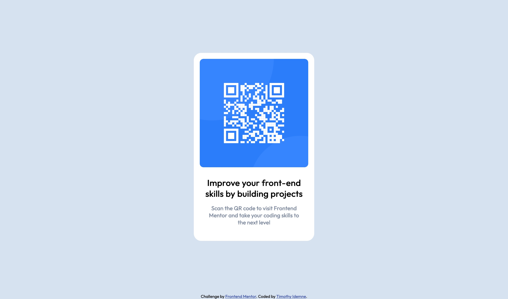
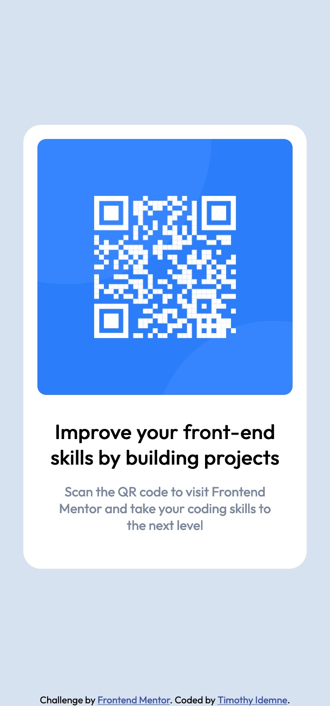

# Frontend Mentor - QR code component solution

This is a solution to the [QR code component challenge on Frontend Mentor](https://www.frontendmentor.io/challenges/qr-code-component-iux_sIO_H). Frontend Mentor challenges help you improve your coding skills by building realistic projects. 

## Table of contents

- [Overview](#overview)
  - [Screenshot](#screenshot)
  - [Links](#links)
- [My process](#my-process)
  - [Built with](#built-with)
  - [What I learned](#what-i-learned)
  - [Continued development](#continued-development)
  - [Useful resources](#useful-resources)
- [Author](#author)

## Overview

Create a simple webpage consisting of a static qr code component with some texts and styling.

### Screenshot




### Links

- Solution URL: [Add solution URL here](https://your-solution-url.com)
- Live Site URL: [Add live site URL here](https://your-live-site-url.com)

## My process

- Analyze the reference/brainstorm 
- Start with markup with HTML5
- Create all styles with CSS
- Touch up/delete any unnecessary codes

### Built with

- Semantic HTML5 markup
- CSS custom properties
- Flexbox
- [Google APIs](https://fonts.googleapis.com/css?family=Outfit) - For fonts

### What I learned

As I am a newbie to frontend design, I normally use default fonts when practicing frontend design skills. So it was helpful having to learn to import fonts. 

```html
<link rel='stylesheet' href='https://fonts.googleapis.com/css?family=Outfit'>
```

### Continued development

Using flexbox is still an area that I'm not fully confident in. I understand its basic usage but I lack the skill in being able to use it efficiently.

Even though this is a simple project, I know that in future projects it will become more necessary to build my flexbox knowledge. So, I'll use these challenges as a template to help build that. 

### Useful resources

- [W3 Schools](https://www.w3schools.com/css/css_font_google.asp) - This helped me to learn how to use google fonts. 

## Author

- Website - [Add your name here](https://www.your-site.com)
- Frontend Mentor - [@yourusername](https://www.frontendmentor.io/profile/yourusername)

**Note: Delete this note and add/remove/edit lines above based on what links you'd like to share.**

